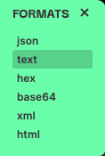
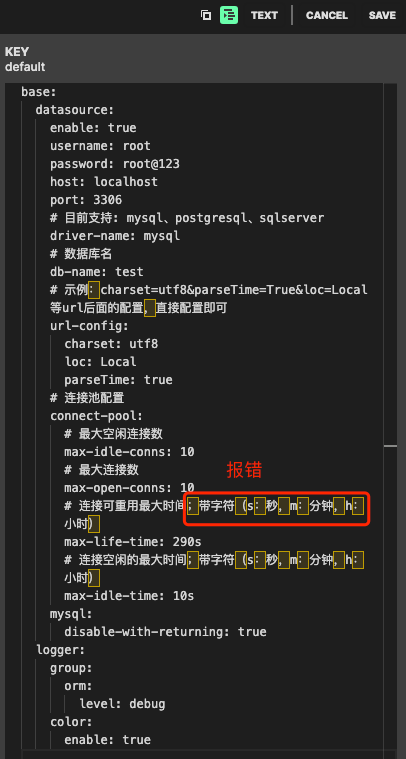
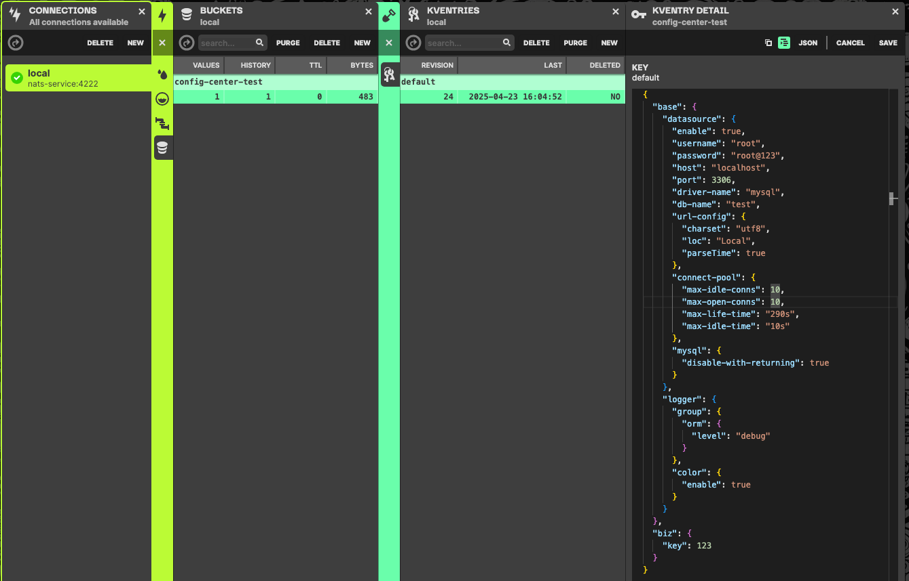

# config-center

基于nats开发的配置中心功能

### 全部配置
```yaml
gole:
  config_center:
    # 是否开启config，默认关闭；开启后，则自动使用对应的注册中心
    enable: true
    # 配置的注册中心：目前只支持nats（其他的配置中心暂时不支持），会直接读取gole.nats的相关配置
    register: nats
    # 服务名称；默认：读取 gole.application.name 配置
    service-name: config-center-test
    # 分组；默认：default
    group: default
    # 配置内容类型：yaml，yml（其实也是yaml），json，properties，默认：yaml
    config-type: json

  # nats配置（配置中心只支持nats-js模式）
  nats:
    enable: true
    # ......... 具体配置请看nats包里面的jetstream配置 ......... 
```
#### 示例：
用法，还是与config包一样，只是main函数需要增加如下的包引入
```go
import _ "github.com/simonalong/gole-boot/extend/config_center"
```
```go
import "github.com/simonalong/gole/config"

config.GetValueInt("xxx.xxx")
config.GetValueInt32("xxx.xxx")
config.GetValueInt64("xxx.xxx")
config.GetValueBool("xxx.xxx")
config.GetValueString("xxx.xxx")
```
目前配置中心的界面使用的是nats的nui管理，如下，可以直接在界面操作，然后config.GetValueXXX("xxx.xxx")获取到最新的值


### 注意事项
目前配置中心使用的是nui的界面，该界面的配置文件内容暂时只支持如下格式，因此我们这边想要存储yaml格式的话，只能选择text，而且内容里面还不能有特殊字符，否则会解析错误，这个是nui这个界面的一个bug

<br/>
因此，我们这边也可以使用json格式，不过记得在application的地方将这个content-type设置为json

```yaml
gole:
  config_center:
    enable: true
    # ...... 省略 ...... 
    # 配置内容类型：yaml，yml（其实也是yaml），json，properties，默认：yaml
    config-type: json
```
