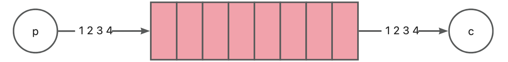
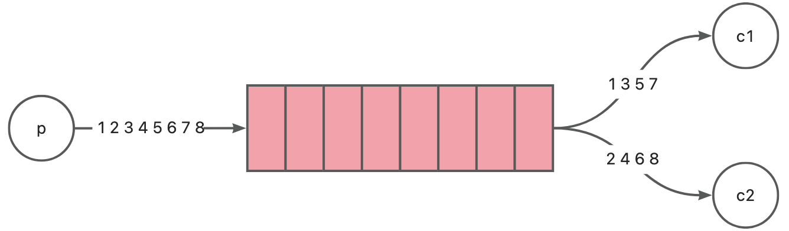
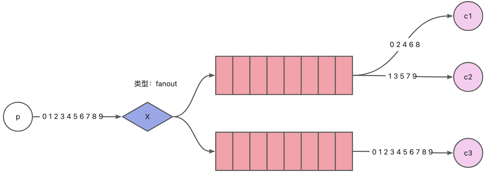
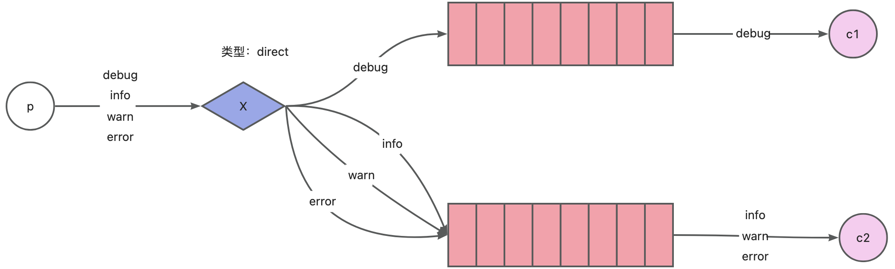
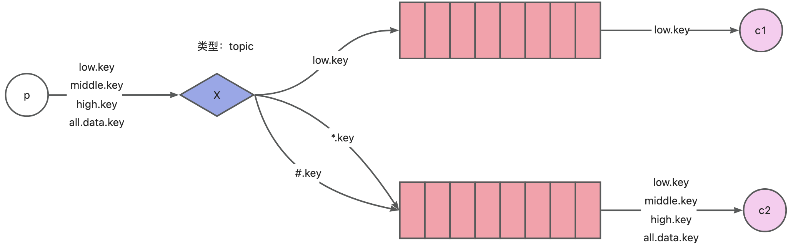
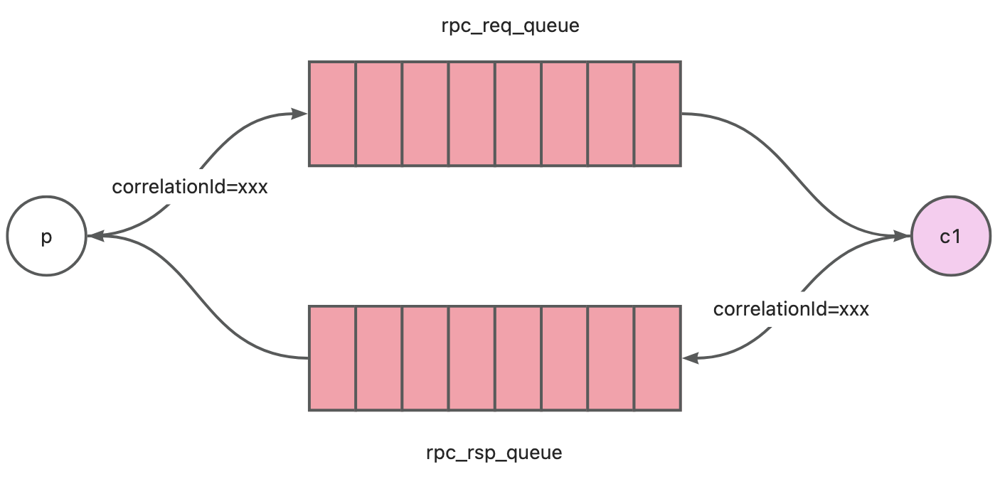

# rabbitmq
将业内的rabbitmq的客户端接入到gole-boot框架中

1. [简单模式](#简单模式)
2. [工作模式](#工作模式)
3. [发布订阅模式](#发布订阅模式)
4. [路由模式](#路由模式)
5. [topic模式](#topic模式)
6. [rpc模式](#rpc模式)


# 模式
rabbitmq有多种使用方式，在使用之前，请先了解下rabbitmq的模式

<h2 id="简单模式">1. 简单模式</h2>


### 生产者
```yaml
# application.yaml 文件
gole:
  rabbitmq:
    enable: true
    user: admin
    password: 123456
    host: 192.168.1.75
    port: 5672
    # 默认空
    vhost: baseBoot
    # 多个队列
    queues:
      - name: simple_queue
    # 多个生产者
    producers:
      - name: p1
```
代码
```go
// 下面rabbitmq引入的都是这个路径，后续就省略了
import "github.com/simonalong/gole-boot/extend/rabbitmq"

func TestSimpleP1(t *testing.T) {
    mqClient, err := rabbitmq.NewClient()
    if err != nil {
        logger.Fatalf("获取mqClient失败:%v", err)
    }
    publisher := mqClient.GetProducer("p1")
    _ = publisher.Send("simple_queue", "hello")
}
```
### 消费者
```yaml
# application.yaml 配置文件
gole:
  rabbitmq:
    enable: true
    user: admin
    password: 123456
    host: 192.168.1.75
    port: 5672
    # 默认空
    vhost: baseBoot
    # 多个队列
    queues:
      - name: simple_queue
    # 多个消费者
    consumers:
      - name: c1
        # 消费者绑定的队列名
        queue: simple_queue
```
代码
```go
func TestSimpleC1(t *testing.T) {
    mqClient, err := rabbitmq.NewClient()
    if err != nil {
        logger.Fatalf("获取mqClient失败:%v", err)
    }

    consumer := mqClient.GetConsumer("c1")
    consumer.Consume(func(d amqp.Delivery) {
        logger.Infof("Received a message: %s", d.Body)
    })
    time.Sleep(1000 * time.Second)
}
```

<h2 id="工作模式">2. 工作模式</h2>


### 生产者
```yaml
# application.yaml 配置文件
gole:
  rabbitmq:
    enable: true
    user: admin
    password: 123456
    host: 192.168.1.75
    port: 5672
    # 默认空
    vhost: baseBoot
    # 多个队列
    queues:
      - name: simple_queue
    # 多个生产者
    producers:
      - name: p1
```
代码
```go
func TestWorkP1(t *testing.T) {
    mqClient, err := rabbitmq.NewClient()
    if err != nil {
        logger.Fatalf("获取mqClient失败:%v", err)
    }
    publisher := mqClient.GetProducer("p1")
    _ = publisher.Send("simple_queue", "hello")
}
```
### 消费者1
```yaml
# application.yaml 文件
gole:
  rabbitmq:
    enable: true
    user: admin
    password: 123456
    host: 192.168.1.75
    port: 5672
    # 默认空
    vhost: baseBoot
    # 多个队列
    queues:
      - name: simple_queue
    # 多个消费者
    consumers:
      - name: c1
        # 消费者绑定的队列名
        queue: simple_queue
```
代码
```go
func TestWorkC1(t *testing.T) {
    mqClient, err := rabbitmq.NewClient()
    if err != nil {
        logger.Fatalf("获取mqClient失败:%v", err)
    }
    consumer := mqClient.GetConsumer("c1")
    consumer.Consume(func(d amqp.Delivery) {
        logger.Infof("Received a message: %s", d.Body)
    })
    time.Sleep(1000 * time.Second)
}
```

### 消费者2
```yaml
# application.yaml 文件
gole:
  rabbitmq:
    enable: true
    user: admin
    password: 123456
    host: 192.168.1.75
    port: 5672
    # 默认空
    vhost: baseBoot
    # 多个队列
    queues:
      - name: simple_queue
    # 多个消费者
    consumers:
      - name: c2
        # 消费者绑定的队列名
        queue: simple_queue
```
代码
```go
func TestWorkC1(t *testing.T) {
    mqClient, err := rabbitmq.NewClient()
    if err != nil {
        logger.Fatalf("获取mqClient失败:%v", err)
    }
    consumer := mqClient.GetConsumer("c2")
    consumer.Consume(func(d amqp.Delivery) {
        logger.Infof("Received a message: %s", d.Body)
    })
    time.Sleep(1000 * time.Second)
}
```

<h2 id="发布订阅模式">3. 发布订阅模式</h2>


### 生产者
```yaml
# application.yaml 配置文件
gole:
  rabbitmq:
    enable: true
    user: admin
    password: 123456
    host: 192.168.1.75
    port: 5672
    # 默认空
    vhost: baseBoot
    # 多个交换机
    exchanges:
      - name: exchange_pubSub
        # 交换机类型，direct，topic，fanout；默认：direct
        kind: fanout
    # 多个生产者
    producers:
      - name: p1
        # 生产者绑定的交换机
        exchange: exchange_pubSub
```
代码
```go
func TestPubSubP1(t *testing.T) {
    rbtMq, err := rabbitmq.NewClient()
    if err != nil {
        logger.Fatalf("获取mqClient失败:%v", err)
    }
    publisher := rbtMq.GetProducer("p1")

    for i := 0; i < 10; i++ {
        body := "Hello World" + "-" + util.ToString(i)
        _ = publisher.Send("", body)
        logger.Infof(" [x] Sent %s", body)
        time.Sleep(1 * time.Second)
    }
}
```
### 消费者1
```yaml
# application.yaml 文件
gole:
  rabbitmq:
    enable: true
    user: admin
    password: 123456
    host: 192.168.1.75
    port: 5672
    # 默认空
    vhost: baseBoot
    # 多个交换机
    exchanges:
      - name: exchange_pubSub
        # 交换机类型，direct，topic，fanout；默认：direct
        kind: fanout
    # 多个队列
    queues:
      - name: queue_pubsub1
    # 多个绑定关系
    binds:
      - name: b1
        # 交换机名称
        exchange: exchange_pubSub
        # 绑定的队列名
        queue: queue_pubsub1
    # 多个消费者
    consumers:
      - name: c1
        # 消费者绑定的队列名
        queue: queue_pubsub1
```
代码
```go
func TestPubSubC1(t *testing.T) {
    rbtMq, err := rabbitmq.NewClient()
    if err != nil {
        logger.Fatalf("获取mqClient失败:%v", err)
    }

    consumer := rbtMq.GetConsumer("c1")
    consumer.Consume(func(d amqp.Delivery) {
        logger.Infof("Received a message: %s", d.Body)
    })
    time.Sleep(1000 * time.Second)
}
```
### 消费者2
```yaml
# application.yaml 文件
gole:
  rabbitmq:
    enable: true
    user: admin
    password: 123456
    host: 192.168.1.75
    port: 5672
    # 默认空
    vhost: baseBoot
    # 多个交换机
    exchanges:
      - name: exchange_pubSub
        # 交换机类型，direct，topic，fanout；默认：direct
        kind: fanout
    # 多个队列
    queues:
      - name: queue_pubsub1
    # 多个绑定关系
    binds:
      - name: b1
        # 交换机名称
        exchange: exchange_pubSub
        # 绑定的队列名
        queue: queue_pubsub1
    # 多个消费者
    consumers:
      - name: c2
        # 消费者绑定的队列名
        queue: queue_pubsub1
```
代码
```go
func TestPubSubC2(t *testing.T) {
    rbtMq, err := rabbitmq.NewClient()
    if err != nil {
        logger.Fatalf("获取mqClient失败:%v", err)
    }

    consumer := rbtMq.GetConsumer("c2")
    consumer.Consume(func(d amqp.Delivery) {
        logger.Infof("Received a message: %s", d.Body)
    })
    time.Sleep(1000 * time.Second)
}
```
### 消费者3
```yaml
# application.yaml 文件
gole:
  rabbitmq:
    enable: true
    user: admin
    password: 123456
    host: 192.168.1.75
    port: 5672
    # 默认空
    vhost: baseBoot
    # 多个交换机
    exchanges:
      - name: exchange_pubSub
        # 交换机类型，direct，topic，fanout；默认：direct
        kind: fanout
    # 多个队列
    queues:
      - name: queue_pubsub3
    # 多个绑定关系
    binds:
      - name: b1
        # 交换机名称
        exchange: exchange_pubSub
        # 绑定的队列名
        queue: queue_pubsub3
    # 多个消费者
    consumers:
      - name: c3
        # 消费者绑定的队列名
        queue: queue_pubsub3
```
代码
```go
func TestPubSubC3(t *testing.T) {
    rbtMq, err := rabbitmq.NewClient()
    if err != nil {
        logger.Fatalf("获取mqClient失败:%v", err)
    }

    consumer := rbtMq.GetConsumer("c2")
    consumer.Consume(func(d amqp.Delivery) {
        logger.Infof("Received a message: %s", d.Body)
    })
    time.Sleep(1000 * time.Second)
}
```

<h2 id="路由模式">4. 路由模式</h2>


### 生产者
```yaml
# application.yaml 配置文件
gole:
  rabbitmq:
    enable: true
    user: admin
    password: 123456
    host: 192.168.1.75
    port: 5672
    # 默认空
    vhost: baseBoot
    # 多个交换机
    exchanges:
      - name: exchange_route
        # 交换机类型，direct，topic，fanout；默认：direct
        kind: direct
    # 多个生产者
    producers:
      - name: p1
        # 生产者绑定的交换机
        exchange: exchange_route
```
代码
```go
func TestRouteP1(t *testing.T) {
    mqClient, err := rabbitmq.NewClient()
    if err != nil {
        logger.Fatalf("获取mqClient失败:%v", err)
    }
    publisher := mqClient.GetProducer("p1")
    for i := 0; i < 10; i++ {
        body := "Hello World" + "-" + indexToType(i)
        _ = publisher.Send(indexToType(i), body)
        logger.Infof(" [x] Sent %s", body)
        time.Sleep(1 * time.Second)
    }
}
func indexToType(index int) string {
    if index < 3 {
        return "debug"
    } else if index < 6 {
        return "info"
    } else if index < 9 {
        return "warn"
    } else if index < 12 {
        return "error"
    }
    return "info"
}
```

### 消费者1
```yaml
# application.yaml 文件
gole:
  rabbitmq:
    enable: true
    user: admin
    password: 123456
    host: 192.168.1.75
    port: 5672
    # 默认空
    vhost: baseBoot
    # 多个交换机
    exchanges:
      - name: exchange_route
        # 交换机类型，direct，topic，fanout；默认：direct
        kind: direct
    # 多个队列
    queues:
      - name: queue_route1
    # 多个绑定关系
    binds:
      - name: debug
        # 交换机名称
        exchange: exchange_route
        key: debug
        # 绑定的队列名
        queue: queue_route1
    # 多个消费者
    consumers:
      - name: c1
        # 消费者绑定的队列名
        queue: queue_route1
```
代码
```go
func TestRouteC1(t *testing.T) {
    rbtMq, err := rabbitmq.NewClient()
    if err != nil {
        logger.Fatalf("获取mqClient失败:%v", err)
    }

    consumer := rbtMq.GetConsumer("c1")
    consumer.Consume(func(d amqp.Delivery) {
        logger.Infof("Received a message: %s", d.Body)
    })
    time.Sleep(1000 * time.Second)
}
```

### 消费者2
```yaml
# application.yaml 文件
gole:
  rabbitmq:
    enable: true
    user: admin
    password: 123456
    host: 192.168.1.75
    port: 5672
    # 默认空
    vhost: baseBoot
    # 多个交换机
    exchanges:
      - name: exchange_route
        # 交换机类型，direct，topic，fanout；默认：direct
        kind: direct
    # 多个队列
    queues:
      - name: queue_route2
    # 多个绑定关系
    binds:
      - name: info-bind
        exchange: exchange_route
        key: info
        queue: queue_route2
      - name: warn-bind
        exchange: exchange_route
        key: warn
        queue: queue_route2
      - name: error-bind
        exchange: exchange_route
        key: error
        queue: queue_route2
    # 多个消费者
    consumers:
      - name: c2
        queue: queue_route2
```
代码
```go
func TestRouteC2(t *testing.T) {
    rbtMq, err := rabbitmq.NewClient()
    if err != nil {
        logger.Fatalf("获取mqClient失败:%v", err)
    }

    consumer := rbtMq.GetConsumer("c2")
    consumer.Consume(func(d amqp.Delivery) {
        logger.Infof("Received a message: %s", d.Body)
    })
    time.Sleep(1000 * time.Second)
}
```

<h2 id="topic模式">5. topic模式</h2>


### 生产者
```yaml
# application.yaml 配置文件
gole:
  rabbitmq:
    enable: true
    user: admin
    password: 123456
    host: 192.168.1.75
    port: 5672
    # 默认空
    vhost: baseBoot
    # 多个交换机
    exchanges:
      - name: exchange_topic
        # 交换机类型，direct，topic，fanout；默认：direct
        kind: topic
    # 多个生产者
    producers:
      - name: p1
        # 生产者绑定的交换机
        exchange: exchange_topic

```
代码
```go
func TestTopicP1(t *testing.T) {
    mqClient, err := rabbitmq.NewClient()
    if err != nil {
        logger.Fatalf("获取mqClient失败:%v", err)
    }
    publisher := mqClient.GetProducer("p1")
    for i := 0; i < 10; i++ {
        body := keyChange(i) + ":" + "Hello World"
        _ = publisher.Send(keyChange(i), body)
        logger.Infof(" [x] Sent %s", body)
        time.Sleep(1 * time.Second)
    }
}

func keyChange(index int) string {
    if index < 3 {
        return "low.key"
    } else if index < 6 {
        return "middle.key"
    } else if index < 9 {
        return "high.key"
    } else if index < 12 {
        return "all.data.key"
    }
    return "all"
}
```
### 消费者1
```yaml
# application.yaml 文件
gole:
  rabbitmq:
    enable: true
    user: admin
    password: 123456
    host: 192.168.1.75
    port: 5672
    # 默认空
    vhost: baseBoot
    # 多个交换机
    exchanges:
      - name: exchange_topic
        # 交换机类型，direct，topic，fanout；默认：direct
        kind: topic
    # 多个队列
    queues:
      - name: queue_topic1
    # 多个绑定关系
    binds:
      - name: low_bind
        # 交换机名称
        exchange: exchange_topic
        key: low.*
        # 绑定的队列名
        queue: queue_topic1
    # 多个消费者
    consumers:
      - name: c1
        # 消费者绑定的队列名
        queue: queue_topic1


```
代码
```go
func TestTopicC1(t *testing.T) {
    rbtMq, err := rabbitmq.NewClient()
    if err != nil {
        logger.Fatalf("获取mqClient失败:%v", err)
    }

    consumer := rbtMq.GetConsumer("c1")
    consumer.Consume(func(d amqp.Delivery) {
        logger.Infof("Received a message: %s", d.Body)
    })
    time.Sleep(1000 * time.Second)
}
```
### 消费者2
```yaml
# application.yaml 文件
gole:
  rabbitmq:
    enable: true
    user: admin
    password: 123456
    host: 192.168.1.75
    port: 5672
    # 默认空
    vhost: baseBoot
    # 多个交换机
    exchanges:
      - name: exchange_topic
        # 交换机类型，direct，topic，fanout；默认：direct
        kind: topic
    # 多个队列
    queues:
      - name: queue_topic2
    # 多个绑定关系
    binds:
      - name: low_bind
        # 交换机名称
        exchange: exchange_topic
        key: '#.key'
        # 绑定的队列名
        queue: queue_topic2
    # 多个消费者
    consumers:
      - name: c2
        # 消费者绑定的队列名
        queue: queue_topic2
```
代码
```go
func TestTopicC2(t *testing.T) {
    rbtMq, err := rabbitmq.NewClient()
    if err != nil {
        logger.Fatalf("获取mqClient失败:%v", err)
    }

    consumer := rbtMq.GetConsumer("c2")
    consumer.Consume(func(d amqp.Delivery) {
        logger.Infof("Received a message: %s", d.Body)
    })
    time.Sleep(1000 * time.Second)
}
```

<h2 id="rpc模式">6. rpc模式</h2>


### 生产者
```yaml
# application.yaml 配置文件
gole:
  rabbitmq:
    enable: true
    user: admin
    password: 123456
    host: 192.168.1.75
    port: 5672
    # 默认空
    vhost: baseBoot
    # 多个队列
    queues:
      - name: rpc_rsp_queue
    # 多个生产者
    producers:
      - name: p1
    # 多个消费者
    consumers:
      - name: p1_c
        # 消费者绑定的队列名
        queue: rpc_rsp_queue

```
代码
```go
func TestRpcP1(t *testing.T) {
    mqClient, err := rabbitmq.NewClient()
    if err != nil {
        logger.Fatalf("获取mqClient失败:%v", err)
    }

    consumer := mqClient.GetConsumer("p1_c")
    consumer.Consume(func(d amqp.Delivery) {
        logger.Infof("收到消息: %s", d.Body)
    })

    publisher := mqClient.GetProducer("p1")

    for i := 0; i < 10; i++ {
        body := "Hello World" + "-" + utils.ToString(i)
        _ = publisher.SendRpcReq("rpc_req_queue", "rpc_rsp_queue", body)
        time.Sleep(1 * time.Second)
    }
}
```
### 消费者1
```yaml
# application.yaml 文件
gole:
  rabbitmq:
    enable: true
    user: admin
    password: 123456
    host: 192.168.1.75
    port: 5672
    # 默认空
    vhost: baseBoot
    # 多个队列
    queues:
      - name: rpc_req_queue
    # 多个消费者
    consumers:
      - name: c1
        # 消费者绑定的队列名
        queue: rpc_req_queue
    # 多个生产者
    producers:
      - name: c1_p
```
代码
```go
func TestRpcC1(t *testing.T) {
    mqClient, err := rabbitmq.NewClient()
    if err != nil {
        logger.Fatalf("获取mqClient失败:%v", err)
    }
	
    consumer := mqClient.GetConsumer("c1")
    consumer.Consume(func(d amqp.Delivery) {
        logger.Infof("收到消息: %s", d.Body)
        publisher := mqClient.GetProducer("c1_p")

        _ = publisher.SendRpcRsp(d, "来自c1：我收到了")
    })
    time.Sleep(1000 * time.Second)
}
```

# 全部配置
```shell
gole:
  rabbitmq:
    enable: true
    user: xx
    password: xx
    host: xx.xx.xx.xx
    port: 5672
    # 默认空
    vhost: xx
    # 多个交换机
    exchanges:
      - name: xx
        # 交换机类型，direct，topic，fanout；默认：direct
        kind: xx
        # 是否持久化，默认true
        durable: true
        # 是否自动删除，默认false
        autoDelete: false
        # 是否内部交换机（内部交换机不发布信息），默认false
        internal: false
        # 是否不等待，默认false
        noWait: false
    # 多个队列
    queues:
      - name: xx
        # 是否持久化，默认true
        durable: true
        # 是否自动删除，默认false
        autoDelete: false
        # 是否独占队列，默认false
        exclusive: false
        # 是否不等待：默认false
        noWait: false
    # 多个绑定关系
    binds:
      - name: xx
        # 交换机名称
        exchange: xx
        # queue绑定的key；默认空
        key: xx
        # 队列名字
        queue: xxx
        # 是否不等待：默认false
        noWait: false
    # 多个生产者
    producers:
      - name: xxx
        # 交换机名称；默认空
        exchange: xxx
        # 表示消息是否必须被路由到至少一个队列；默认false
        # true：则消息必须被路由到至少一个队列。如果没有匹配的路由键，则消息将被返回给生产者
        # false：如果没有匹配的路由键，则消息将被丢弃
        mandatory: false
        # 表示消息是否需要立即被路由到队列。默认false
        # 为true，则消息需要立即被路由到队列。如果没有匹配的路由键，则消息将被返回给生产者。
        # 为false，则消息将被缓存，直到有队列绑定到交换器，并且有匹配的路由键
        immediate: false
        # 发布者配置
        publishing:
          # MIME 消息内容类型，比如text/plain，application/json等
          contentType: text/plain
          # MIME 消息内容编码
          contentEncoding: utf-8
          # 临时 (0 or 1) or 永久 (2)
          deliveryMode: 2
           # 消息优先级（0~9）；0 表示最低优先级，9 表示最高优先级
          priority: 0
          # 消息回复queue；这个属性只在RPC模式中使用，用于将响应消息发送到正确的目标队列中
          replyTo: xxx
          # 消息过期时间；属性是一个整数值，单位为毫秒。指定了消息在队列中存活的时间长度。当消息的过期时间到达时，消息将被自动删除；示例：30000；就是30秒
          expiration: xxx
          # 消息类型；可以是任意字符串值，但是一些常见的类型包括：text：文本消息、image：图片消息、audio：音频消息、video：视频消息、json：json消息、xml：xml消息、application：应用程序消息等
          type: text
    # 多个消费者
    consumers:
      - name: xx
        # 消费者绑定的队列名
        queue: xx
        # 是否自动提交，默认true
        autoAck: true
        # 是否独占这个queue：默认false
        exclusive: false
        # 是否等待回复后再交付，默认false
        noWait: false
```
